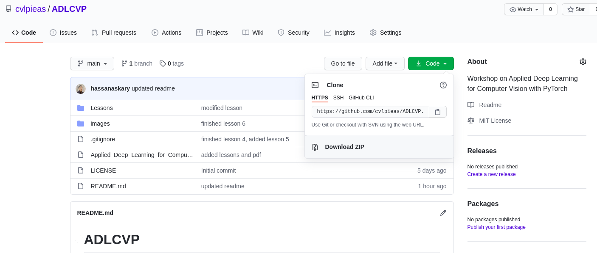

# ADLCVP

Workshop on Applied Deep Learning for Computer Vision with PyTorch is an introductory course on the tools used in deep learning and computer vision.

## Goals

After taking this course you should be:

- Familiar with the tools used in Computer Vision
- Able to create Neural Networks in PyTorch
- Know the right tool for the job

## Syllabus and Structure

1. Lightning fast Python Primer
2. Package managers and virtual environments
3. Jupyter notebooks, Colab, and cloud GPUs
4. Numpy
5. Scikit-learn
6. OpenCV
7. Matplotlib and Seaborn
8. TSNE and UMAP
9. Web Scrapping
10. PyTorch 1 (Intro, CNN)
11. Tensorboard, model, result, loss visualization
12. PyTorch 2 (Autoencoders, Unet)
13. PyTorch 3 (Resnet)
14. PyTorch 4 (GAN with attention)
15. tmux, ssh, scp, sshfs, glances, htop, nvidia-smi

## Lecture Videos

Lectures videos will be available soon on our YouTube channel [here](https://tinyurl.com/cvlpieas).

## How to Open Lectures

You will first have to download this repo. You can do this by either cloning this repo by typing:
```
git clone https://github.com/cvlpieas/ADLCVP.git
```
or by downloading it as a zip file by clicking the green "Code" button then "Downlaod ZIP".


All the lessons are in the "Lessons" folder. Most of them are Jupyter notebooks so you will need jupyter installed. You can install jupyter by typing:
```
pip install jupyter
```
or if using conda
```
conda install jupyter
```
then you have to run the jupyter server inside the folder. You can do it by typing:
```
jupyter notebook
```
Now you can browse the files inside this repo. Open the "Lessons" folder and select the lesson you want to open.

## Instructors

- Umar Farooq - [GitHub](https://github.com/umar467)
- Hassan Askary - [Website](https://hassanaskary.com) / [GitHub](https://github.com/hassanaskary) / [LinkedIn](https://linkedin.com/in/hassanaskary)
